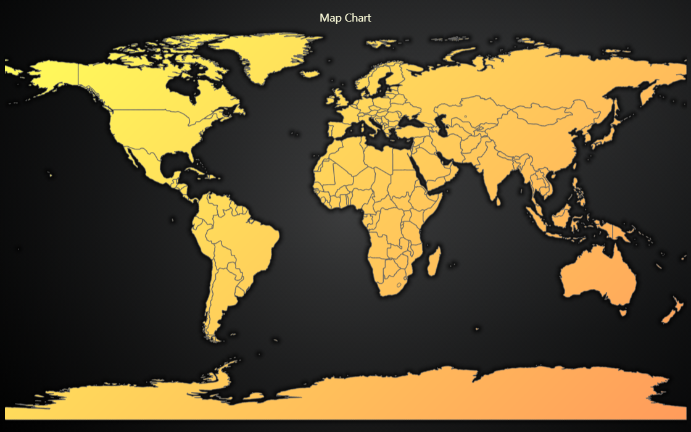

# Map Chart



This demo application belongs to the set of examples for LightningChart JS, data visualization library for JavaScript.

LightningChart JS is entirely GPU accelerated and performance optimized charting library for presenting massive amounts of data. It offers an easy way of creating sophisticated and interactive charts and adding them to your website or web application.

The demo can be used as an example or a seed project. Local execution requires the following steps:

-   Make sure that relevant version of [Node.js](https://nodejs.org/en/download/) is installed
-   Open the project folder in a terminal:

          npm install              # fetches dependencies
          npm start                # builds an application and starts the development server

-   The application is available at _http://localhost:8080_ in your browser, webpack-dev-server provides hot reload functionality.


## Description

Very simple overview of MapChart feature.

A `MapChart` is created by selecting one of the 9 available _Map types_:

-   `MapTypes.World`
-   `MapTypes.Europe`
-   `MapTypes.Africa`
-   `MapTypes.Asia`
-   `MapTypes.NorthAmerica`
-   `MapTypes.SouthAmerica`
-   `MapTypes.Australia`
-   `MapTypes.USA`
-   `MapTypes.Canada`

This example showcases `MapTypes.World`, but you can try the other ones by simply editing this one part in the live editor:

```js
const mapChart = lightningChart().Map({
    type: MapTypes.World, // <--- Select MapType HERE
})
```

**More map examples**:

-   [Data visualization over LightningChart JS Map Charts](https://lightningchart.com/lightningchart-js-interactive-examples/examples/lcjs-example-1103-mapChartVizXY.html)
-   [Data visualization over Google Maps](https://blog.arction.com/easy-geospatial-data-visualization-with-lightningchart-js-and-google)
-   [LightningChart JS Map Charts with Drill-down](https://lightningchart.com/lightningchart-js-interactive-examples/examples/lcjs-example-1111-covidDrillDownDashboard.html)
-   [Data visualization over static map picture](https://lightningchart.com/lightningchart-js-interactive-examples/examples/lcjs-example-1110-geoChartUsaTemperature.html)


## API Links

* [Map chart]
* [Map types]
* [Radial gradient fill]
* [Color RGBA]


## Support

If you notice an error in the example code, please open an issue on [GitHub][0] repository of the entire example.

Official [API documentation][1] can be found on [LightningChart][2] website.

If the docs and other materials do not solve your problem as well as implementation help is needed, ask on [StackOverflow][3] (tagged lightningchart).

If you think you found a bug in the LightningChart JavaScript library, please contact support@lightningchart.com.

Direct developer email support can be purchased through a [Support Plan][4] or by contacting sales@lightningchart.com.

[0]: https://github.com/Arction/
[1]: https://lightningchart.com/lightningchart-js-api-documentation/
[2]: https://lightningchart.com
[3]: https://stackoverflow.com/questions/tagged/lightningchart
[4]: https://lightningchart.com/support-services/

© LightningChart Ltd 2009-2022. All rights reserved.


[Map chart]: https://lightningchart.com/lightningchart-js-api-documentation/v4.0.0/classes/MapChart.html
[Map types]: https://lightningchart.com/lightningchart-js-api-documentation/v4.0.0/variables/MapTypes.html
[Radial gradient fill]: https://lightningchart.com/lightningchart-js-api-documentation/v4.0.0/classes/RadialGradientFill.html
[Color RGBA]: https://lightningchart.com/lightningchart-js-api-documentation/v4.0.0/functions/ColorRGBA.html

